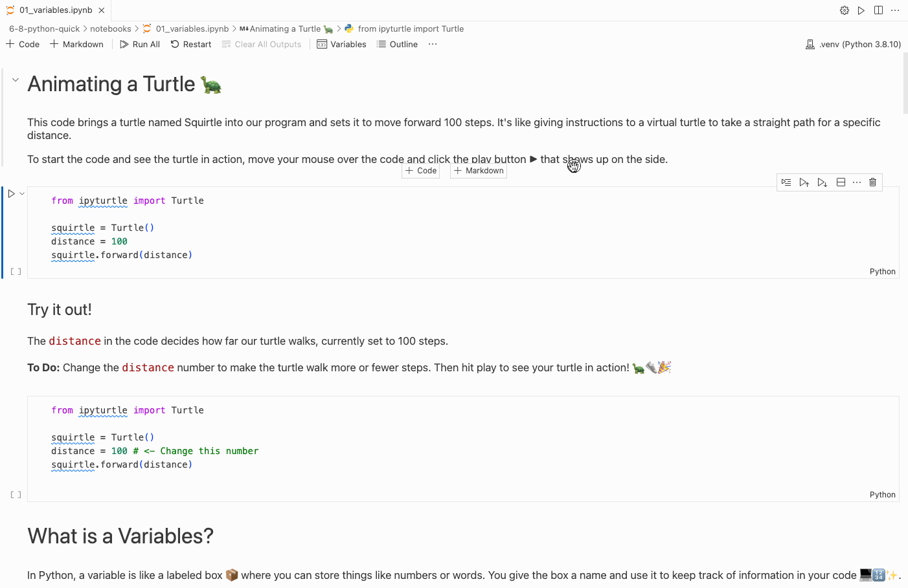

# Python Variables 🐍

---

## 📚 What will we learn?

- How to run Python code?
- How to call a function?
- How to create a variable?

---

## Animating a turtle 🐢 
```py
from ipyturtle import Turtle

squirtle = Turtle()
distance = 100
squirtle.forward(distance)
```

Creates a turtle named Squirtle and moves it forward 100 steps in a straight line. 🐢👟

<!-- 
Code Breakdown

- `squirtle = Turtle()`: This line creates a new turtle named Squirtle in our code.
- `distance = 100`: We set a variable named `distance` to 100, which is the number of steps Squirtle will move.
- `squirtle.forward(distance)`: This makes Squirtle move forward 100 steps, the value we set for `distance`.
-->
---
<!-- _footer: "" -->

## Run the code



<!-- 
1) In the upper right corner of select the kernel "python 3.8"
2) Hover your mouse over the code cell and press the play button that appears to the right

Note: you only need to select the kernel the first time. Just press the play button for all future runs
-->
---

## Try it out

```py
distance = 100 ← Change this number
```

Change the `distance` and run the code to see how Squirtle goes!

<!--
Stop here and have the students complete the interactive "try it out" code cell in there notebook

They are asked to change the `distance`` to another number and checkout the results.
-->
---

## What is a variables?

A variable in Python is a named container 📦 that holds data, like numbers or words, for use in your code.

```py
number = 100   ← A variable named number

word = "dog"   ← A variable named word
```

<!--
Explain variables as named containers for data.

- Use `number = 100` as an example of storing a numbers.
  - We use `=` to tell python the variable number holds the number 100
  
- Use `word = "dog"` to show storing a string, they can have spaces.
  - Don't forget the quotes!
  - Single or double quotes it does not matter

- Emphasize variables' role in organizing and using data in code.
-->

---

## Math with variables

Math operators that we use in Python:

| Symbol   | Operation     |
|----------|---------------|
| `+`      | Addition      |
| `-`      | Subtraction   |
| `*`      | Multiplication|
| `/`      | Division      |

<!--
A list of basic math operations in python.

Students may be unfamiliar with using * for multiplication. Remind them that is we were to use `x` then would think it was a variable.

-->

---

## How to add `+` numbers?

```py

squirtle = Turtle()
distance = 200
squirtle.forward(distance + 50)

```

Adds 50 to `distance` to move Squirtle forward 250 steps.

<!-- 
Code Breakdown

- `squirtle = Turtle()`: Creates a new turtle, Squirtle.
- `distance = 200`: Sets `distance` to 200 steps.
- `squirtle.forward(distance + 50)`: Squirtle moves forward 250 steps (200 + 50).
-->


---

### Try it out

```py
squirtle.forward(distance + 50) ← Change 50 to 150
```

Add 150 instead of 50 check out the results

<!-- 
Result: the turtle will walk further
-->

---

## How to subtract `-` numbers?

```py

squirtle = Turtle()
distance = 200 
subtraction = 100
squirtle.forward(distance - subtraction)

```

Here we subtract two variables

<!-- 
Here we learn how to:
- define a new variable
- preform calculations using just variables

We create 2 variables then calculate the difference using just the variables instead of raw numbers

Student should think of the variables as named placeholders for the value they contain
-->

---

### Try it out

```py

subtraction = 100 ← Change this

squirtle.forward(distance - subtraction)

```

Change `subtraction` to a number greater than 200

<!-- 
Result: the turtle will move backwards
-->

---

## How to multiply `*` numbers?

```py

squirtle = Turtle()
distance = 200
multiplier = 2
result = distance * multiplier
squirtle.forward(result)

```

This code demonstrates multiplying two variables to move a turtle.

<!-- 
Here we learn how to:
- Perform multiplication using variables.
- Variables can be used to store the output of calculations

1) We create two variables, 'distance' and 'multiplier' 
2) Then use them to calculate a value and store it in 'result' 
3) 'result' is used to move the turtle.

Students should understand that variables act as containers for values 
-->

---

## How do we make turns?

```py

squirtle = Turtle()
squirtle.forward(100)
squirtle.right(90)
squirtle.forward(100)
squirtle.left(90)

```

<!-- 

- `squirtle.forward(100)` tells Squirtle to move straight ahead by 100 steps. It's like taking a long walk in a straight line.

- `squirtle.right(90)` tells Squirtle to turn to its right by 90 degrees. Imagine Squirtle facing right at a corner.

- After moving another 100 steps forward, `squirtle.left(90)` makes Squirtle turn left by 90 degrees, like taking another turn on its path.
-->

---

## Turning half way ½

```py

squirtle = Turtle()
half_way_degrees = 360 / 2
squirtle.right(half_way_degrees)

```

- Remember a full circle has 360 degrees. 
- We divide by 2 to get half-way.

<!-- 
`half_way_degrees = 360 / 2`

This calculates half of a circle. A full circle has 360 degrees, so dividing by 2 gives us 180 degrees for a half-circle.


`squirtle.right(half_way_degrees)`

Here, we tell Squirtle to turn right by the number of degrees in `half_way_degrees`, making a half-circle turn.
-->

--- 

## Have fun with the code challenges

<!-- 
There are a series of 6 different code challenges at the bottom of the notebook for the students to complete.
-->