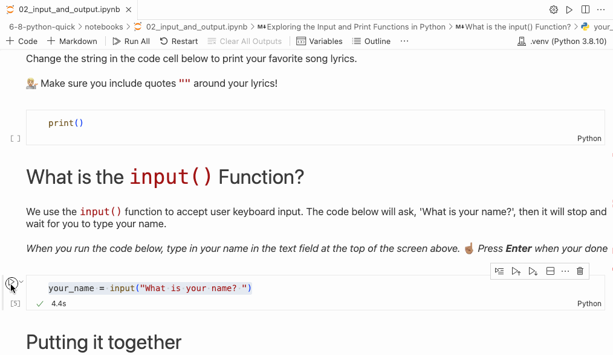
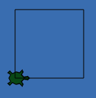

# Input and Output 🐍

---

## 📚 What will we learn?

- How to print out information
- How to input information
- How to use user input

---

## What is `print()`?

<style>
html,body        {height: 100%;}
.wrapper         {width: 70%; max-width: 1280px; height: 100%; margin: 0 auto; background: rgba(255, 255, 255, .0); padding-bottom: 50px}
.h_iframe        {position: relative; padding-top: 56%;}
.h_iframe iframe {position: absolute; top: 0; left: 0; width: 100%; height: 100%;}
</style>

<div class="wrapper">
    <div class="h_iframe">
        <iframe height="2" width="2" src="https://www.youtube.com/embed/IzSaOmNVFF8" title="YouTube video player" frameborder="0" allow="accelerometer; autoplay; clipboard-write; encrypted-media; gyroscope; picture-in-picture; web-share" allowfullscreen></iframe>
    </div>
</div>

--- 

## Breaking it down

**Code:**
```py
print("Hello developer")
```
**Output:**
```
Hello developer
```

<!--
Breaking Down the Syntax

- `print()`: A function in Python for displaying text on the screen. It's a command that tells the computer to show something.

- Parentheses `()`: Essential for functions like `print` to specify what to display. Without them, the computer won't know what to do.

- Double Quotes `" "`: Enclose the message inside `print()`. They indicate that the content is text. 

-->

---

<!-- _footer: "" -->

# What is a string

| Is this a String   |  Code            |
|--------------------|------------------|
| ✅                 | `"hello"`        |
| ✅                 | `'how are you?'` |
| ✅                 | `"123"`          |
| ❌                 | `123`            |
| ❌                 | `True`           |

**Rule:** Strings are always surrounded by single `'` or double `"` quotes

<!--
- Strings are text wrapped in single quotes
- Strings are always surrounded by single `'` or double `"` quotes
- Numbers can be in strings
- But strings that are numbers don't work the same way as regular numbers!
-->

---

## What is `input()`?

<style>
html,body        {height: 100%;}
.wrapper         {width: 70%; max-width: 1280px; height: 100%; margin: 0 auto; background: rgba(255, 255, 255, .0); padding-bottom: 50px}
.h_iframe        {position: relative; padding-top: 56%;}
.h_iframe iframe {position: absolute; top: 0; left: 0; width: 100%; height: 100%;}
</style>

<div class="wrapper">
    <div class="h_iframe">
        <iframe height="2" width="2" src="https://www.youtube.com/embed/iMuGFwX1Iaw" title="YouTube video player" frameborder="0" allow="accelerometer; autoplay; clipboard-write; encrypted-media; gyroscope; picture-in-picture; web-share" allowfullscreen></iframe>
    </div>
</div>

---

## Using `input()` Jupyter



<!--
When students run code with the input() function in jupyter a keyboard input prompt will appear at the top of the screen.
-->
---

## Breaking it down

**Code:**
```py
input("What is your name?")
print("Nice to meet you," + your_name + "!")
```
**Output:**
```
What is your name? Batman
Nice to meet you, Batman
```

<!--
Breaking Down the Syntax

- `input()` Function: A command in Python that waits for you to type something and hit Enter.

- Parentheses and String: Uses parentheses `()` with a string inside, like `"What is your name?"`, to display a question and wait for an answer.

- Saving Your Answer: `input()` captures your typed response when you press Enter.

- Variable `your_name`: Creates a 'variable', a storage box labeled `your_name`, where Python saves what you typed.

- The code is split into two cell in the students notebooks. Students may wonder why their name is not displayed in the first code cell. This is because we did not print `your_name`. In the next code cell we print it out.

-->

---

## Build Your Own Calculator! 🧮✨

**Guided Exercise**

<!--

This is a 3 step guided exercise where the students will create their own calculator to add numbers

- They will use input(), print(), and float()

Step 1) Ask for user input `input()``
Step 2) Convert the user input to numbers using `float()`
Step 3) Print the result 

-->
---

### Step 1 - Ask for user input

```py
first_input_number = input("Enter the first number: ")

second_input_number = ...
```

*Finish the code*

<!--

Ask the class to complete the unfinished code in their notebooks

Solution: `input("Enter the second number: ")`

-->
---

### Step 1 - Ask for user input

```py
first_input_number = input("Enter the first number: ")

second_input_number = input("Enter the second number: ")
```

---

### Step 2 - Convert the input

<table>

<tr>
<th>Code</th>
<th>Output</th>
</tr>

<tr>
<td>
  
```py
number = 5
print(number + 5)
```
  
</td>
<td>

```py
10
```

</td>
</tr>

<tr>
<td>
  
```py
number = "5"
print(number + "5")
```
  
</td>
<td>

```py
55
```

</td>
</tr>

<tr>
<td>
  
```py
number = "5"
print(number + 5)
```
  
</td>
<td>

**❌ Error**

</td>
</tr>

</table>

<!--

This slide explains why we need to convert strings to numbers. The

Input() always returns a string

Row 1 - Both numbers so its simple arithmetic

Row 2 - Both strings so python put the string together side-by-side this is known as "string concatenation"

Row 3 - One is a number and the other is a string, we can not add numbers and sting together. They are different data types
-->
---

### Step 2 - Convert the input

```py
first_number = float(first_input_number)
second_number = ...
```

*Finish the code*

<!--

Note: they must run the prior code cell for this to work!

We use the float() function to convert a string that contains a number into a number.
  - we can user int() too but it does not handle decimal numbers.

Ask the class to complete the unfinished code in their notebooks

Solution: `float(second_input_number)`

-->
---

### Step 2 - Convert the input

```py
first_number = float(first_input_number)
second_number = float(second_input_number)
```

---

### Step 3: Do the Math!

```py
result = first_number + second_number

print()
```

*Finish the code*

<!--

They need to `print(result)`

Tip: make sure they don't add quotes around the `result` variable name because that will make it a string.

-->
---

### Step 3: Do the Math!

```py
result = first_number + second_number

print(result)
```

---

## Turtle Challenge 🐢🕹

Lets control `squirtle` with keyboard commands

---

### Keyboard Control 

```py
squirtle = Turtle()

user_input = input("How many feet?")
feet = int(user_input)
squirtle.forward(feet)

squirtle.right(int(input("How many degrees?")))

squirtle.forward(int(input("How many feet?")))
```

<!-- 
1. First Input for Feet:
    - Use `input()` to ask for feet distance. 
    - Save input as a string in `user_input`, then convert to an integer in `feet`.
    - `squirtle.forward(feet)` moves Squirtle forward by the entered feet value.

2. Turning Squirtle
    - Directly input and convert degrees with `squirtle.right(int(input("...")))`.
    - The response is first taken by `input()`, converted by `int()`, and used to turn Squirtle.

3. Moving Squirtle Again:
    - Ask for feet distance again, process the input with `input()` and `int()`, then move Squirtle with `squirtle.forward()`.
-->

---

### The challenge



<!-- 

- Start with the given code, then add lines to let the user guide the turtle using `int(input())` for movements.

Hints: 
  - Experiment with the code: Enter `100`, `90`, `100` to make one corner of a square.

  - Think about the number of sides and corners in a square, and how many times Squirtle needs to move forward and turn right to complete it.

-->