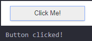

# Click Listeners in Python 🖱️👂

---
## What are click listeners?

- Click listeners respond to mouse clicks.
- Perform an action when a click happens

<!-- 
- This slide introduces the concept of click listeners.
- Emphasizes their importance in creating interactive applications in Python.
-->

---

## An Example
```python
import ipywidgets as widgets
from IPython.display import display

button = widgets.Button(description="Click Me!")
def on_button_clicked(b):
    print("Button clicked!")
button.on_click(on_button_clicked)
display(button)
```

<!-- 
- Demonstrates how to import necessary libraries and create a button widget.
- Shows defining a function that executes when the button is clicked.
- Illustrates attaching the click event handler to the button and displaying it.
-->

---

## Steps to Create A Click Listener
---

### Creating a Button 🖲️

- You have to create a button to assign the click listener to
- The description is the text on the button

```python
button = widgets.Button(description="Click Me!")
```
---
### Defining An Event Handler Function 🎪
- An event handler function is what runs when the button is clicked
- It must take in one parameter: the button
```python
def on_button_clicked(b):
    print("Button clicked!")
```

<!-- 
- Talk about how clicking is the "event", the function is run to "handle" the event
- The b argument is the button itself. You don't have to use in the function
-->
---
### Attaching The Function 🩹
- Now that you have defined your function, you need to attach it to your button
- Use `on_click` to attach

```python
button.on_click(on_button_clicked)
```

<!-- 
- This is how the code knows what function to run when the button is clicked
-->
---
### Displaying Your Button 🖼️

- Finally, once you setup your button to listen for clicks, we have to display it
- Use the `display` function

```python
display(button)
```

<!-- 
- Make sure students understand that creating the button and displaying it are separate steps
- Like creating a string variable vs printing it out
-->
---
### The Result 🔘
- Your button should look like this! Try it out

---

## Turtle Challenges 🐢

---

### Turtle Controls 🕹️
- Add buttons to move the turtle left and right
- Now you can move around the canvas!

---

### Shape Drawer 🟧
- Add buttons to draw each shape
- Circle, Triangle, Square, Star, or Octagon
- Use the `clear` function to wipe the canvas clean before drawing the next shape
<!-- 
- The clear function is used by calling turtle.clear() where turtle is their turtle
- It removes all previous drawings from the screen
-->

---
### Circle Example 🟣
```python
# Create the turtle
turtle = Turtle()
# Create your buttons here
circle_button = widgets.Button(description='Circle')
# Define your event handler functions here
def draw_circle(b):
    turtle.clear()
    turtle.circle(50)
# Attach your buttons
circle_button.on_click(draw_circle)
# Display your buttons
display(circle_button)
```